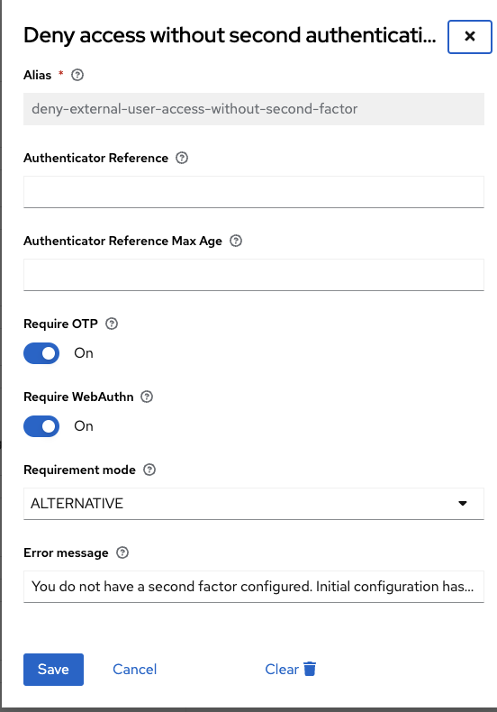

# Keycloak Authenticator deny user access without second factor

This Keycloak Authenticator denies a user, that has not configured a second factor
like OTP or Passkey the access.

It can e.g. used in a CONDITION Sub-Flow together with https://github.com/elexis/keycloak-conditional-http-header-authenticator  to deny login from external if a second factor has not yet been configured via the internal
network connection.

## Configuration

This authenticator can be configured to

* require an OTP to be available in the stored credentials of the user
* require a Passkey o be available in the stored credentials of the user
* set mode to ALTERNATIVE (with either one of them being sufficient) or REQUIRED (both have to be available)

